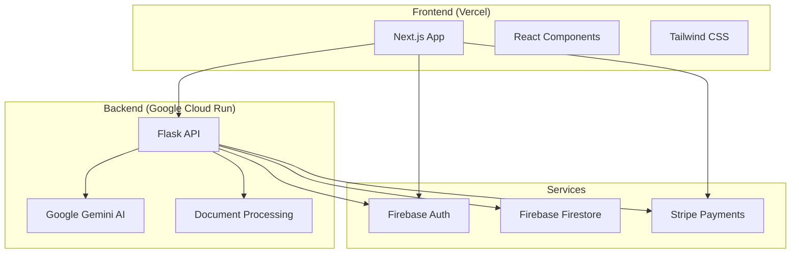

# 🎓 Mentor de Concursos

<div align="center">


**Uma plataforma inteligente de preparação para concursos públicos com IA**

[](https://github.com/seu-usuario/mentor-concursos-app)
[](LICENSE)

</div>

---

## 📋 Índice

- [Sobre o Projeto](#-sobre-o-projeto)
- [Funcionalidades](#-funcionalidades)
- [Tecnologias](#-tecnologias)
- [Arquitetura](#-arquitetura)
- [Instalação](#-instalação)
- [Configuração](#-configuração)
- [Deploy](#-deploy)
- [API](#-api)
- [Contribuição](#-contribuição)
- [Licença](#-licença)

---

## 🎯 Sobre o Projeto

O **Mentor de Concursos** é uma plataforma completa de preparação para concursos públicos que utiliza inteligência artificial para oferecer uma experiência personalizada de estudo. A aplicação combina análise de documentos, geração de questões personalizadas e acompanhamento de progresso para maximizar o desempenho dos candidatos.

### 🎯 Objetivos

- **Personalização**: Adaptar o conteúdo de estudo às necessidades específicas de cada candidato
- **Eficiência**: Otimizar o tempo de estudo através de IA e análise inteligente
- **Acessibilidade**: Interface intuitiva e responsiva para todos os dispositivos
- **Escalabilidade**: Arquitetura robusta para suportar milhares de usuários

---

## ✨ Funcionalidades

### 🤖 Inteligência Artificial
- **Análise de Documentos**: Upload e processamento de PDFs e documentos Word
- **Geração de Questões**: Criação automática de questões baseadas no conteúdo
- **Feedback Inteligente**: Correção e explicações detalhadas das respostas
- **Recomendações Personalizadas**: Sugestões de estudo baseadas no desempenho

### 📚 Gestão de Conteúdo
- **Biblioteca de Materiais**: Organização e categorização de documentos
- **Simulados Personalizados**: Criação de provas adaptadas ao nível do usuário
- **Histórico de Estudos**: Acompanhamento detalhado do progresso
- **Estatísticas Avançadas**: Métricas de performance e áreas de melhoria

### 💳 Sistema de Pagamentos
- **Planos Flexíveis**: Diferentes modalidades de assinatura
- **Pagamentos Seguros**: Integração com Stripe para transações seguras
- **Gestão de Assinaturas**: Controle completo de planos e renovações

### 🔐 Autenticação e Segurança
- **Login Social**: Integração com Google e outras plataformas
- **Controle de Acesso**: Sistema de permissões baseado em roles
- **Dados Protegidos**: Criptografia e conformidade com LGPD

---

## 🛠 Tecnologias

### Backend
- **Python 3.12** - Linguagem principal
- **Flask 3.0.0** - Framework web
- **Google Generative AI** - Integração com Gemini
- **Firebase Admin SDK** - Banco de dados e autenticação
- **Stripe** - Processamento de pagamentos
- **Gunicorn** - Servidor WSGI para produção

### Frontend
- **Next.js 14.0.4** - Framework React
- **React 18.2.0** - Biblioteca de interface
- **TypeScript 5.3.3** - Tipagem estática
- **Tailwind CSS 3.3.6** - Framework de estilos
- **Firebase 10.7.1** - SDK cliente
- **Axios** - Cliente HTTP

### Infraestrutura
- **Google Cloud Run** - Hospedagem do backend
- **Vercel** - Hospedagem do frontend
- **Docker** - Containerização
- **Firebase** - Banco de dados e autenticação
- **Stripe** - Gateway de pagamento

---

## 🏗 Arquitetura



### 📁 Estrutura do Projeto

```
mentor-concursos-app/
├── 📁 backend/                 # API Flask
│   ├── 📄 main_enhanced.py     # Servidor principal
│   ├── 📄 requirements.txt     # Dependências Python
│   ├── 📁 core/                # Lógica de negócio
│   ├── 📁 api/                 # Endpoints REST
│   └── 📁 uploads/            # Arquivos temporários
├── 📁 frontend/               # Next.js App
│   ├── 📄 package.json        # Dependências Node.js
│   ├── 📄 next.config.mjs     # Configuração Next.js
│   └── 📁 src/                # Código fonte React
├── 📄 vercel.json             # Configuração Vercel
├── 📄 netlify.toml            # Configuração Netlify
├── 📄 Dockerfile              # Configuração Docker
├── 📄 DEPLOY.md               # Instruções de deploy
└── 📄 ENVIRONMENT_VARIABLES.md # Variáveis de ambiente
```

---

## 🚀 Instalação

### Pré-requisitos

- **Node.js** 18+ 
- **Python** 3.12+
- **Git**
- **Conta Google Cloud** (para Gemini API)
- **Projeto Firebase**
- **Conta Stripe**

### 1. Clone o Repositório

```bash
git clone https://github.com/seu-usuario/mentor-concursos-app.git
cd mentor-concursos-app
```

### 2. Backend Setup

```bash
# Navegue para o diretório backend
cd backend

# Crie ambiente virtual
python -m venv venv

# Ative o ambiente virtual
# Linux/Mac:
source venv/bin/activate
# Windows:
venv\Scripts\activate

# Instale dependências
pip install -r requirements.txt
```

### 3. Frontend Setup

```bash
# Navegue para o diretório frontend
cd frontend

# Instale dependências
npm install
```

---

## ⚙️ Configuração

### 1. Variáveis de Ambiente

Crie os arquivos `.env` necessários:

#### Backend (.env)
```bash
# 🚨 CRÍTICO: Gemini API
GOOGLE_API_KEY=your_gemini_api_key

# Firebase Admin SDK
FIREBASE_PROJECT_ID=your_project_id
FIREBASE_PRIVATE_KEY="your_private_key"
FIREBASE_CLIENT_EMAIL=your_client_email

# Stripe
STRIPE_SECRET_KEY=your_stripe_secret_key
STRIPE_WEBHOOK_SECRET=your_webhook_secret

# Configurações
FLASK_ENV=development
PORT=5000
```

#### Frontend (.env.local)
```bash
# API Backend
NEXT_PUBLIC_API_URL=http://localhost:5000

# Firebase (Configuração Pública)
NEXT_PUBLIC_FIREBASE_API_KEY=your_api_key
NEXT_PUBLIC_FIREBASE_AUTH_DOMAIN=your_project.firebaseapp.com
NEXT_PUBLIC_FIREBASE_PROJECT_ID=your_project_id
NEXT_PUBLIC_FIREBASE_STORAGE_BUCKET=your_project.appspot.com
NEXT_PUBLIC_FIREBASE_MESSAGING_SENDER_ID=your_sender_id
NEXT_PUBLIC_FIREBASE_APP_ID=your_app_id

# Stripe (Chave Pública)
NEXT_PUBLIC_STRIPE_PUBLISHABLE_KEY=your_publishable_key
```

### 2. Configuração Firebase

1. Crie um projeto no [Firebase Console](https://console.firebase.google.com)
2. Ative Authentication e Firestore Database
3. Baixe as credenciais do Admin SDK
4. Configure as regras de segurança

### 3. Configuração Stripe

1. Crie uma conta no [Stripe](https://stripe.com)
2. Obtenha as chaves de API
3. Configure webhooks para eventos de pagamento

---

## 🚀 Deploy

### Deploy Automático

O projeto está configurado para deploy automático:

- **Frontend**: Vercel (conectado ao GitHub)
- **Backend**: Google Cloud Run (via Docker)

### Deploy Manual

#### Frontend (Vercel)

```bash
# Instale Vercel CLI
npm i -g vercel

# Deploy
cd frontend
vercel --prod
```

#### Backend (Google Cloud Run)

```bash
# Configure gcloud CLI
gcloud auth login
gcloud config set project YOUR_PROJECT_ID

# Build e deploy
docker build -t mentor-concursos .
docker tag mentor-concursos gcr.io/YOUR_PROJECT_ID/mentor-concursos
docker push gcr.io/YOUR_PROJECT_ID/mentor-concursos

# Deploy no Cloud Run
gcloud run deploy mentor-concursos \
  --image gcr.io/YOUR_PROJECT_ID/mentor-concursos \
  --platform managed \
  --region us-central1 \
  --allow-unauthenticated
```

### 📋 Checklist de Deploy

- [ ] Configurar Firebase Project
- [ ] Obter chave Gemini API
- [ ] Configurar Stripe Account
- [ ] Adicionar variáveis no Vercel
- [ ] Adicionar variáveis no Google Cloud Run
- [ ] Testar integração completa

---

## 🔌 API

### Endpoints Principais

#### Health Check
```http
GET /health
```

#### Upload de Documentos
```http
POST /api/upload
Content-Type: multipart/form-data
```

#### Geração de Questões
```http
POST /api/generate-questions
Content-Type: application/json
```

#### Processamento de Respostas
```http
POST /api/process-answer
Content-Type: application/json
```

### Exemplo de Uso

```javascript
// Upload de documento
const formData = new FormData();
formData.append('file', file);

const response = await fetch('/api/upload', {
  method: 'POST',
  body: formData
});

// Geração de questões
const questions = await fetch('/api/generate-questions', {
  method: 'POST',
  headers: {
    'Content-Type': 'application/json'
  },
  body: JSON.stringify({
    documentId: 'doc123',
    difficulty: 'medium',
    count: 10
  })
});
```

---

## 🤝 Contribuição

Contribuições são bem-vindas! Para contribuir:

1. **Fork** o projeto
2. Crie uma **branch** para sua feature (`git checkout -b feature/AmazingFeature`)
3. **Commit** suas mudanças (`git commit -m 'Add some AmazingFeature'`)
4. **Push** para a branch (`git push origin feature/AmazingFeature`)
5. Abra um **Pull Request**

### Padrões de Código

- **Python**: PEP 8
- **JavaScript/TypeScript**: ESLint + Prettier
- **Commits**: Conventional Commits
- **Documentação**: Markdown

---

## 📄 Licença

Este projeto está sob a licença MIT. Veja o arquivo [LICENSE](LICENSE) para mais detalhes.

---

## 📞 Suporte

- **Email**: suporte@mentorconcursos.com
- **Discord**: [Comunidade Mentor Concursos](https://discord.gg/mentorconcursos)
- **Issues**: [GitHub Issues](https://github.com/seu-usuario/mentor-concursos-app/issues)

---

<div align="center">

**Desenvolvido com ❤️ para ajudar candidatos a conquistarem seus objetivos**

[](https://github.com/seu-usuario/mentor-concursos-app)
[](https://github.com/seu-usuario/mentor-concursos-app/fork)

</div>
